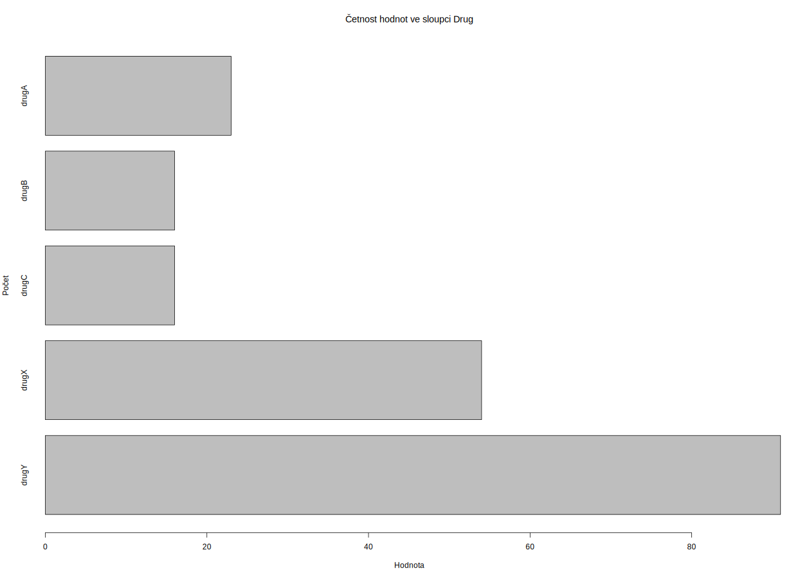
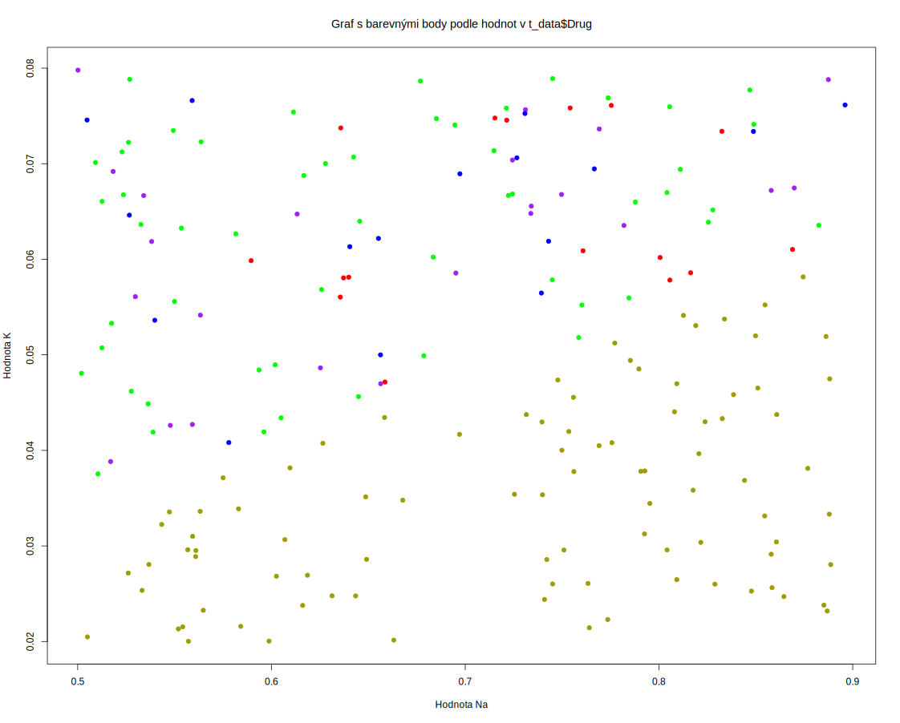
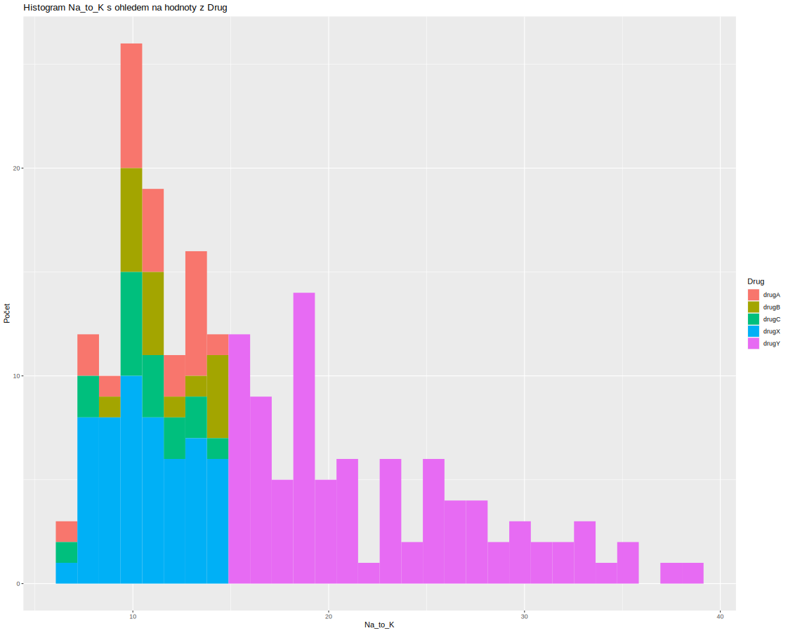
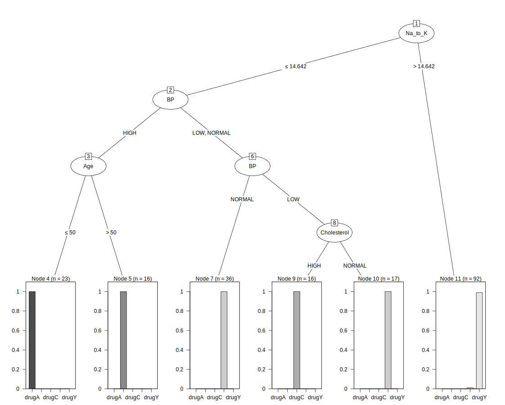
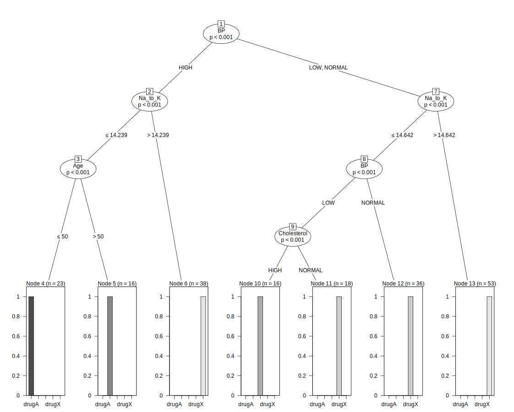
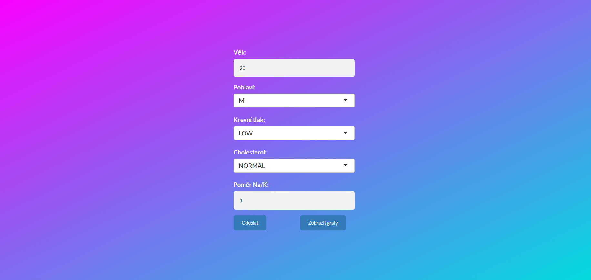
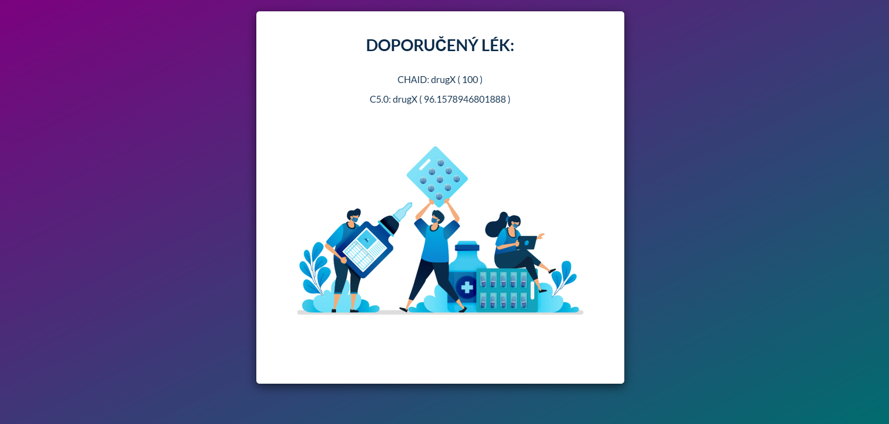
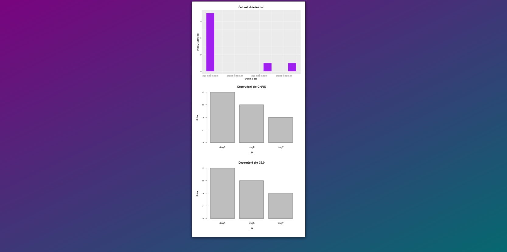
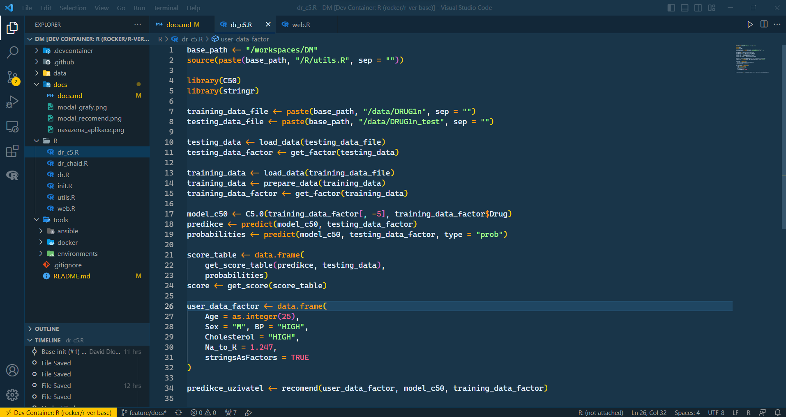
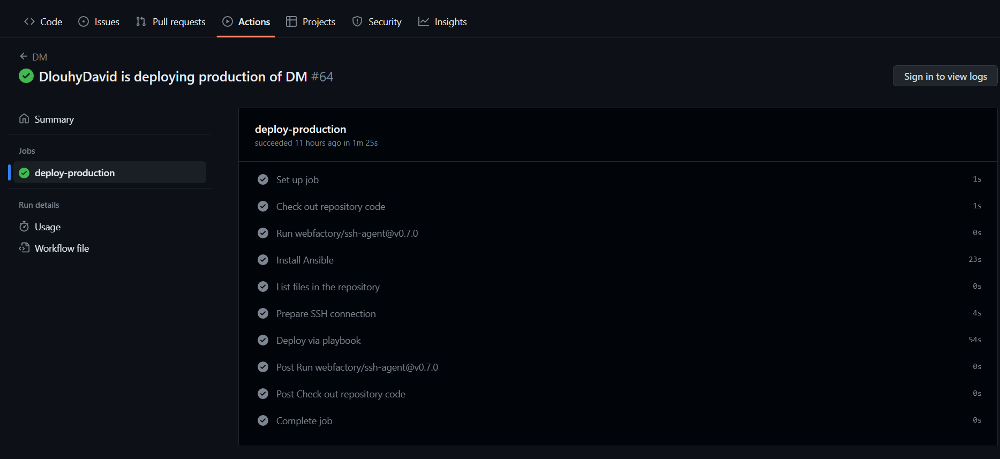

# Doporučení léku

# Úvod

Cílem projektu je převedení streamu do jazyka R. Následující dokumentace popisuje jak jsem tento problém řešil, jaké prostŘedky jsem zvolil a jaký je finální výstup. Na zaČátku se také věnuji datům a jejich analýze.

# Data

Používám dodaný dataset z e-learinigu. Prakticky je to [tento dataset](https://www.kaggle.com/datasets/prathamtripathi/drug-classification). Po rozkliknutí odkazu je možné zjistit podrobnější infomrace ohledně struktry.


# Analýza dat

Data jsou rozdělena na testovací a trénovací množinu. Kdy trénovací je třeba ještě upravit.

Významy:
- Léky x a y jsou určeny pro poměr draslíku v krvi.
- Lék c je na nízký krevní tlak
- Léky a a b jsou na vysoký krevní tlak
- Lidé mladší 50 let užívají a
- Lidé starší 50 let užívají b

# Modely

## C5.0
C5.0 je algoritmus pro klasifikaci a regresi v datovém dolování. Je to nástupce algoritmu ID3. C5.0 využívá stromovou strukturu pro rozhodování, přičemž každý uzel stromu reprezentuje testování určitého atributu a každá hrana reprezentuje možnost výsledku testu. C5.0 používá vahy pro každý případ v datové množině, což znamená, že každý případ může mít jinou váhu v procesu učení. To umožňuje přizpůsobit se nerovnoměrnému rozložení tříd v datové množině. C5.0 používá různé techniky pro výběr atributů, což umožňuje snížit dimenzionalitu dat a zvýšit přesnost klasifikace. C5.0 používá různé techniky pro výběr atributů, což umožňuje snížit dimenzionalitu dat a zvýšit přesnost klasifikace. C5.0 umožňuje průběžné učení, což znamená, že může být trénován postupně na nových datech a přizpůsobovat se novým okolnostem. C5.0 dokáže pracovat s chybějícími hodnotami v datech a umí je nahradit pomocí různých technik, jako je například interpolace nebo použití nejpravděpodobnější hodnoty.

## CHAID
CHAID (Chi-squared Automatic Interaction Detector) je stromový model rozhodovacího stromu, který se používá pro analýzu vztahů mezi dvěma nebo více kategoriálními proměnnými. Jedná se o metodu, která se používá k identifikaci nejvýznamnějších interakcí mezi různými proměnnými a předpovídání výsledků na základě těchto interakcí.

CHAID se skládá z několika fází, které zahrnují:

- Výběr proměnných: CHAID pracuje pouze s kategoriálními proměnnými. V této fázi se vybírají proměnné, které mají být zahrnuty do modelu.
- Vytvoření stromu: CHAID vytváří strom rozdělením dat na jednotlivé uzly, které představují různé hodnoty kategoriálních proměnných. Každý uzel je rozdělen na dva poduzly, které představují nejlepší rozdělení dat.
- Testování statistické významnosti: CHAID testuje statistickou významnost rozdílů mezi jednotlivými poduzly, aby určil, které rozdělení jsou statisticky významné.
- Vytvoření konečného stromu: CHAID vytváří konečný strom tím, že postupně sjednocuje uzly, které nejsou statisticky významné, a tím snižuje složitost modelu.

Výstupem modelu CHAID je strom, který ukazuje, jak jsou kategoriální proměnné propojeny a jaký vliv mají na predikovanou proměnnou. Strom zahrnuje rozhodovací pravidla, která lze použít pro předpovídání výsledků. Model CHAID se používá v mnoha oblastech, jako jsou marketingové analýzy, medicínská diagnostika a sociologické výzkumy.

# Repozitář

Repozitář obsahuje následující adresáře:
- ``.devcontainer``
    - obsahuje definici vývojojového kontejenru pro VSC
- .``github/workflows``
    - obsahuje soubory pro GitHub Actions
- ``data``
    - adresář s daty
- ``docs``
    - adresář s dokumentací
- ``R``
    - skripty v jazyce R
- ``tools``
    - podpůrné nástorje
    - ``anible``
        - pro automaitzaci
    - ``docker``
        - pro kontejenry
    - ``environments``
        - pro env

# Kód

## Instalace balíčků
Nejprve je třeba naisntalovat potŘebné balíčky. K tomu jsem připravil skript s názvem ``init.R``
Pro úspěšné spuštění aplikace je třeba nainstalovat následující balíčky:

- shinythemes
- stringr
- C50
- ggplot2
- CHAID

Balíčky lze nainstalovat pomocí příkazu ``install.packages()`` ve vaší R konzoli.


```R
install.packages(c("shinythemes", "stringr", "C50", "ggplot2"))
install.packages("CHAID", repos = "http://R-Forge.R-project.org")
```

První řádek nainstaluje balíčky shinythemes, stringr, C50 a ggplot2. Druhý řádek nainstaluje balíček CHAID z repozitáře http://R-Forge.R-project.org.

## Užitečné nástoje

Pro celý projekt jsem si nadefinoval modul, který obashuje užitečné funkce.

### ``load_data``

Používá se k načtení dat ze souboru v CSV formátu. Funkce má jeden argument, "file_path", který označuje cestu k souboru s daty.

Vnitřek funkce se skládá z několika kroků:

- Nejprve se data načtou pomocí funkce "read.csv", která načte CSV soubor a uloží ho do proměnné "data".
- Poté se data vrátí pomocí příkazu "return(data)", čímž se funkce ukončí a vrátí výsledná data.

Tuto funkci lze použít jako součást většího programu, který potřebuje načíst data ze souboru v CSV formátu. Pokud má tento program předem definovanou cestu k souboru, může tuto funkci použít k načtení dat a dále s nimi pracovat. Aktuálně slouiží pro zjednodušení budoucího možného rozšíření.

### ``get_factor``

Tato funkce slouží k převodu dat na faktory.Funkce má jeden argument, "data", který označuje data, která mají být převedena na faktory.

Vnitřek funkce se skládá z několika kroků:

- Nejprve se data převedou na data.frame pomocí funkce "data.frame".
- Následně se pomocí argumentu "stringsAsFactors = TRUE" nastaví, že všechny sloupce obsahující textové řetězce budou převedeny na faktory.
- Poté se několik konkrétních sloupců převede na faktory pomocí funkce "as.factor".
- Nakonec se převedená data vrátí pomocí příkazu "return(data_factor)".

Tuto funkci lze použít jako součást většího programu, který potřebuje data převést na faktory pro analýzu nebo vizualizaci dat. Funkce vytvoří nový data.frame, ve kterém jsou určité sloupce převedeny na faktory, což umožní další manipulaci s daty.

### ``prepare_data``

Tato funkce slouží k přípravě dat pro další analýzu nebo vizualizaci. Funkce má jeden argument, "data", který označuje data, která mají být připravena. 

Vnitřek funkce se skládá z několika kroků:

- Nejprve se provede výpočet poměru mezi sloupci "Na" a "K" pomocí operátoru "/".

- Následně se sloupce "Na" a "K" odstraní z datasetu pomocí příkazu "data$Na <- NULL" a "data$K <- NULL".

- Nakonec se připravená data vrátí pomocí příkazu "return(data)".

Tuto funkci lze použít jako součást většího programu, který potřebuje data upravit tak, aby byla vhodná pro další analýzu. Funkce odstraňuje některé sloupce a přidává nový sloupec vypočtený na základě stávajících sloupců. Tímto způsobem lze upravit data tak, aby byla vhodná pro konkrétní analýzu nebo vizualizaci.

### ``get_score_table``

Tato funkce slouží k přípravě tabulky pro výpočet skóre pro určitý model. Funkce má dva argumenty, "predikce" a "data". Argument "predikce" označuje vektor s predikcemi modelu a "data" označuje dataset s informacemi o jednotlivých pozorováních.

Vnitřek funkce se skládá z několika kroků:

- Nejprve se převede vektor predikcí na řetězce pomocí funkce "as.character".

- Následně se získá sloupec "Drug" z datasetu "data" a převede se na řetězec.

- Poté se pomocí funkce "str_detect" zjistí, zda se jednotlivé predikce shodují s hodnotami v sloupci "Drug" datasetu "data". Výsledkem tohoto kroku je logický vektor "x3".

- Nakonec se vytvoří a vrátí tabulka, která obsahuje tři sloupce - "x1" s predikcemi, "x2" se sloupcem "Drug" z datasetu "data" a "x3" s výsledky z kroku 3.

Tuto funkci lze použít jako součást většího programu, který potřebuje vypočítat skóre pro určitý model. Funkce vytváří tabulku, která obsahuje informace o predikcích a hodnotách z datasetu, které se od predikcí liší. Tato tabulka může být dále použita pro výpočet skóre nebo jako vstup pro další analýzy.

### ``get_score``

Tato funkce vrací součet hodnot sloupce x3 v tabulce score_table. Tato hodnota představuje skóre a získá se tak, že se spočítá počet případů, kdy predikce není shodná s označeným lékem. Každý takový případ přispívá k celkovému skóre hodnotou 1.

### ``recomend``

Tato funkce přijímá uživatelská data (user_data), model klasifikace (model) a faktorizovaná trénovací data (training_data_factor) a vrací doporučení léčby včetně jistoty.

Nejprve se vstupní data převedou na faktory stejným způsobem jako trénovací data. Poté se provede predikce na základě modelu a vypočítají se pravděpodobnosti jednotlivých tříd (typ predikce "prob"). Následně se doporučí léčba s nejvyšší pravděpodobností a jistota se vypočte jako maximální hodnota pravděpodobností náležení k třídě vydělená 100. Výsledné doporučení léčby a jistota se pak uloží do datového rámce (recomendations) a vrátí jako výstup funkce.

### ``store_user_data``

Tato funkce slouží k uložení dat od uživatele včetně doporučení léčby ze dvou různých modelů do souboru. Konkrétně uloží data uživatele, doporučení od modelu C5.0 a doporučení od modelu CHAID, spolu s časem uložení.

Funkce přijímá následující argumenty:

- user_data: data uživatele ve formě datového rámce
- recomend_c50: doporučení léčby od modelu C5.0
- recomend_chaid: doporučení léčby od modelu CHAID
- path: cesta k souboru, kam se mají data uložit

Funkce používá funkci cbind() k připojení sloupců s výsledky obou modelů k datům uživatele. Následně se výsledný datový rámec uloží do souboru pomocí funkce write.table().

### ``load_user_data``

Funkce slouží k načtení historických dat od uživatele ze souboru uloženého na dané cestě. Načtená data jsou vrácena ve formě datového rámce (data.frame).

Vstupy:

- path - Řetězcová hodnota obsahující cestu ke souboru s historickými daty od uživatele.
Výstupy:

- data - Datový rámec obsahující načtená historická data od uživatele, kde jednotlivé sloupce obsahují následující informace:
- Age - Věk uživatele.
- Sex - Pohlaví uživatele.
- BP - Krevní tlak uživatele.
- Cholesterol - Cholesterol uživatele.
- Na_to_K - Poměr sodíku a draslíku uživatele.
- RecomendCHAID - Doporučený lék vypočítaný pomocí algoritmu CHAID.
- ConfidenceCHAID - Jistota doporučení léku vypočítaná pomocí algoritmu CHAID.
- RecomendC50 - Doporučený lék vypočítaný pomocí algoritmu C5.0.
- ConfidenceC50 - Jistota doporučení léku vypočítaná pomocí algoritmu C5.0.
- Time - Čas, kdy byla doporučení léku provedena.

## Ukázka C5.0

Ukázka toho, jak v R použít model C5.0 pro doporučení léku na zkaĺadě dat od uživatele.

Nejprve je určena základní cesta k pracovnímu adresáři a načteny potřebné knihovny pro práci s daty a tvorbu modelů. Poté jsou načtena trénovací a testovací data ze souborů a připravena pro použití pomocí funkcí "load_data", "get_factor" a "prepare_data" definovaných v "utils.R".

Následně je vytvořen model pro doporučení léčby na základě trénovacích dat pomocí funkce "C5.0" z knihovny "C50". Model je natrénován na faktorizovaných trénovacích datech, tedy vektoru předpovídané proměnné "Drug" a faktorizovaných hodnotách všech dalších proměnných. Poté jsou s použitím vytvořeného modelu a testovacích dat předpovězena doporučení pro léčbu a pravděpodobnosti příslušnosti k jednotlivým kategoriím léčiv s použitím funkcí "predict" a "predict.type" z knihovny "C50".

Poté je vypočteno skóre pro přesnost modelu s použitím funkce "get_score" z "utils.R" na základě výsledků předpovědí a testovacích dat.

Nakonec jsou vytvořeny data pro nového uživatele a předpovězena doporučení léčby s použitím funkce "recomend" z "utils.R" s použitím natrénovaného modelu a faktorizovaných trénovacích dat. Výsledkem je predikce, tedy doporučení léčby a jistota v procentech přiřazené k predikci.

## Ukázka CHAID

Ukázka toho, jak v R použít model CHAID pro doporučení léku na zkaĺadě dat od uživatele.

Nejprve je určena základní cesta k pracovnímu adresáři a načteny potřebné knihovny pro práci s daty a tvorbu modelů. Poté jsou načtena trénovací a testovací data ze souborů a připravena pro použití pomocí funkcí "load_data", "get_factor" a "prepare_data" definovaných v "utils.R".

Následně je vytvořen model pro doporučení léčby na základě trénovacích dat pomocí funkce "CHAID" z knihovny "CHAID". Model je natrénován na faktorizovaných trénovacích datech, tedy vektoru předpovídané proměnné "Drug" a faktorizovaných hodnotách všech dalších proměnných. Poté jsou s použitím vytvořeného modelu a testovacích dat předpovězena doporučení pro léčbu a pravděpodobnosti příslušnosti k jednotlivým kategoriím léčiv s použitím funkcí "predict" a "predict.type" z knihovny "CHAID".

Poté je vypočteno skóre pro přesnost modelu s použitím funkce "get_score" z "utils.R" na základě výsledků předpovědí a testovacích dat.

Nakonec jsou vytvořeny data pro nového uživatele a předpovězena doporučení léčby s použitím funkce "recomend" z "utils.R" s použitím natrénovaného modelu a faktorizovaných trénovacích dat. Výsledkem je predikce, tedy doporučení léčby a jistota v procentech přiřazené k predikci.

## Kompletní ukázka

Kompletní ukázka kombinuje pŘedchozí dvě ukaźky a doplňuje je o grafy. Snažil jsem se co nejvíce přiblížit streamu, který jsme dělali na hodině.

Shrnutí kroků:

- Import modulů, v tomto případě soubor utils.R, který se nachází v adresáři /workspaces/DM
- Import knihoven: C50, CHAID, stringr, ggplot2
- Definice cest pro trénovací a testovací data
- Načtení testovacích dat ze souboru DRUG1n_test a uložení do proměnné testing_data
- Zobrazení tabulky testing_data pomocí funkce View()
- Převedení proměnné testing_data na faktory pomocí funkce get_factor()
- Načtení trénovacích dat ze souboru DRUG1n a uložení do proměnné training_data
- Seřazení trénovacích dat podle sloupce "Drug" podle abecedy a uložení do proměnné training_data_sorted
- Vykreslení sloupcového grafu s počtem hodnot ve sloupci "Drug" pomocí funkce barplot()
- Vykreslení bodového grafu s barevnými body podle hodnot ve sloupci "Drug" pomocí funkce plot()
- Příprava sloupce Na_to_K pomocí funkce prepare_data()
- Převedení trénovacích dat na faktory pomocí funkce get_factor()
- Vytvoření histogramu Na_to_K s ohledem na hodnoty z Drug pomocí knihovny ggplot2
- Příprava modelu C5.0 a uložení do proměnné model_c50
- Predikce na testovacích datech pomocí funkce predict()
- Výpočet pravděpodobností pomocí funkce predict() s parametrem type = "prob"
- Vytvoření tabulky s výsledky predikce a pravděpodobnostmi
- Výpočet počtu špatných predikcí pomocí funkce get_score() a výstup na obrazovku pomocí funkce cat()
- Zobrazení tabulky s výsledky predikce a pravděpodobnostmi pomocí funkce View()
- Vykreslení stromu rozhodování pomocí funkce plot() pro model C5.0
- Příprava modelu CHAID a uložení do proměnné model_chaid
- Predikce na testovacích datech pomocí funkce predict()
- Výpočet pravděpodobností pomocí funkce predict() s parametrem type = "prob"
- Vytvoření tabulky s výsledky predikce a pravděpodobnostmi
- Výpočet počtu špatných predikcí pomocí funkce get_score() a výstup na obrazovku pomocí funkce cat()
- Zobrazení tabulky s výsledky predikce a pravděpodobnostmi pomocí funkce View()
- Vykreslení stromu rozhodování pomocí funkce plot() pro model CHAID.0







# Webové rozhraní

Kód začíná importem několika balíků v jazyce R: "shiny", "shinythemes", "C50", "CHAID", "stringr" a "ggplot2". Poté se definuje proměnná "base_path", která obsahuje cestu k umístění souborů. Následují funkce "store_user_data", "recomend" a "load_user_data", které jsou načteny ze souboru "utils.R". Poté se definují názvy souborů pro trénovací, testovací a uživatelská data, a také obrázek pro modalní dialog.

Následují načtení dat ze souborů a příprava dat pro trénování modelů. Poté jsou vytvořeny dva modely - "model_chaid" a "model_c50". "model_chaid" je rozhodovací strom vytvořený pomocí funkce "ctree" z balíku "CHAID", který používá proměnné "Age", "Sex", "BP", "Cholesterol" a "Na_to_K" k predikci proměnné "Drug". "model_c50" je klasifikační model vytvořený pomocí funkce "C5.0" z balíku "C50", který používá všechny proměnné k predikci "Drug", kromě "Na_to_K".

Tento kód definuje uživatelské rozhraní pro aplikaci. Používá knihovny "shiny" a "shinythemes" pro vytvoření interaktivního webového rozhraní.



Nastavuje se téma "flatly" pro rozhraní a definuje se vlastní CSS styl pro různé prvky rozhraní, jako jsou tlačítka, vstupní pole a výstupní pole. Vzhledem k pozadí aplikace se používá lineární gradient, který mění barvu z fialové na modrou.

Následně jsou definovány vstupní prvky pro uživatele, jako jsou numerická vstupní pole, výběrové seznamy a tlačítka pro odeslání dat a zobrazení grafů.



Funkce server slouží jako prostředník mezi uživatelským rozhraním (UI) a výpočetními funkcemi aplikace. Funkce server očekává vstupní proměnnou input a výstupní proměnnou output.V první části funkce server se definuje komponenta pro zobrazení obrázku, která je vykreslena pomocí funkce renderImage. Obrázek se načte z proměnné image_rec a zobrazí se na stránce. Dále následuje blok kódu, který je vyvolán po stisknutí tlačítka submit. Funkce observeEvent sleduje změny na vstupní proměnné input a v případě stisknutí tlačítka submit vykoná funkci, která načte data z uživatelského rozhraní a provede predikci pomocí modelů CHAID a C5.0. Výsledkem jsou dvě proměnné result_chaid a result_c50, které obsahují textové odpovědi pro uživatele. Tyto odpovědi jsou následně zobrazeny v modálním okně spolu s obrázkem.

Po zobrazení výsledků se data z uživatelského rozhraní uloží do souboru pomocí funkce store_user_data. Funkce store_user_data přijímá argumenty: user_data, predikce_uzivatel_c50, predikce_uzivatel_chaid a user_data_file.



V poslední části funkce server se definuje blok kódu, který je vyvolán po stisknutí tlačítka show_plot. Funkce observeEvent sleduje změny na vstupní proměnné input a v případě stisknutí tlačítka show_plot vykreslí grafy pro analýzu dat. Výsledné grafy se zobrazí v modálním okně pomocí funkce showModal.

# Vývoj

Vývoj jsem prováděl unvitř vývojového kontjenru v editoru VSCode  (*.devcontainer*). Je tedy nutné mít naistalované prostředí pro kontejenry (containerd, Podman, Docker...) a VSCode včetně podpůrných rozšíření.

Seznam rozšíření:
- [Remote Development](https://marketplace.visualstudio.com/items?itemName=ms-vscode-remote.vscode-remote-extensionpack)
- [Dev Containers](https://marketplace.visualstudio.com/items?itemName=ms-vscode-remote.remote-containers)
- [DotENV](https://marketplace.visualstudio.com/items?itemName=mikestead.dotenv)
- [Remote - Tunnels](https://marketplace.visualstudio.com/items?itemName=ms-vscode.remote-server)
- [Remote Explorer](https://marketplace.visualstudio.com/items?itemName=ms-vscode.remote-explorer)
- [Docker](https://marketplace.visualstudio.com/items?itemName=ms-azuretools.vscode-docker)
- Pouze v kontejneru: 
    - [R](https://marketplace.visualstudio.com/items?itemName=REditorSupport.r)
    - [R Debugger](https://marketplace.visualstudio.com/items?itemName=RDebugger.r-debugger)

Následně stačí projekt naklonovat. Stiskněte ``shift+p`` a vyberte možnost ``Reopen in container``. Automaticky se spustí kontejner s přípavenými soubory a je možné vyvíjet. Nezapomeňte spustit skript ``R/init.R``, který nainstaluje závislosti.



## Alternativna

Připravte si klasické prostředí a můžete vyíjet. Tuto možnost nepreferuji, a proto i neuvádím popis, jak prostředí zprovoznit.

# Nasazení

K naszaení projektu se používá CD pipeline. Protože je projekt uložen na GitHubu, tak jsem se rozhodl zvolit možnost GitHub Actions. Využívám shared runners a nástroj Ansible. Nasazuji na svůj veřejný server jako kontejner. Nasazuje se Shiny webová aplikace.

## Continous Deployment

Automatizované nasazení produkčního prostředí > Soubor obsahuje definici práce (``job``), která se bude provádět, když je proveden push do GitHubu.

První část kódu definuje název a běhové jméno pro danou práci. Dále definuje událost (event), která vyvolá spuštění daného úkolu (``job``). V tomto případě se spustí, když je proveden push do GitHubu.

V části ``jobs`` se definuje běh práce ``deploy-production``. Tato práce se spustí na operačním systému ``ubuntu-latest`` a obsahuje několik kroků (``steps``), které se provedou postupně.

První krok ``Check out repository code`` stáhne z GitHubu kód repozitáře, se kterým se bude pracovat. Druhý krok ``uses: webfactory/ssh-agent@v0.7.0`` definuje použití SSH agenta s privátním klíčem, který je uložen v tajemství (``secrets``) v GitHubu. Třetí krok ``Install Ansible`` nainstaluje nástroj Ansible pro automatizované nasazení.

Další krok ``List files in the repository`` vypíše seznam souborů v pracovním adresáři. Poté následují kroky pro přípravu SSH spojení s vzdáleným serverem, který bude použit pro nasazení aplikace. Poslední krok ``Deploy via playbook`` spustí playbook (soubor s instrukcemi pro automatizované nasazení), který provádí samotné nasazení aplikace na produkční server. Při spuštění tohoto playbooku se předává proměnná ``GIT_BRANCH`` s hodnotou získanou z názvu aktuální větve v GitHub repozitáři. Také se předává ``inventory`` soubor, kde jsou cílové storje, kam se nasazuje.



## Konfigurace serveru

Na serveru musí být nainstalované prostředí pro kontejnery. Je nutní i SSH spojení a dedikovaný uživatel pro nasazení, který bude mít v ``authorized_keys`` veřejný klíč (pár s privátním ze ``secret`` v repo)Také se zde musí dle požadovaných cest nacházet i ``env`` soubor a data pro modely. Všechny soubory, lze nahrát pomocí protokolu ``scp``. Příklad použítí:

```shell
scp '<local_path>/DRUG1n' <remote_user>@<remote_host>:<remote_path>/data/
scp '<local_path>/DRUG1n_test' <remote_user>@<remote_host>:<remote_path>/data/
scp '<local_path>/production.env' <remote_user>@<remote_host>:<remote_path>/tools/environments/production.env
```

Na serveru musí být také povolen port, na kterém je apikace propsána. Upravte tedy Firewall dle potřeby. Doporučuji také zkontrolovat parametry konfigurace pro SELinux.

**ENV proměnné a jejich význam:**
- ``DM_LOCATION`` = místo, kde je projekt naklonovaný
- ``DM_PORT`` =  port, na který bude aplikace propsána
- viz. ``example.env`` = to je šablona

## Ansible

Jedná se o nástroje, který používá ``yml`` definice pro automatiazci operativy. Kokrétní poŽití je popsáno výše.

## Docker

Pro běh aplikace je požit Docker kontejner. Konkrétně se nasazuje pomocí ``docker-compose`` definice. Tento docker compose soubor definuje jednu službu (``service``) s názvem ``server``. Tato služba bude běžet na Docker kontejneru z obrazu ``rocker/shiny:4.3.0``.

Služba bude poslouchat na portu, který je definován v proměnné prostředí ``DM_PORT``. Tento port bude mapován na port ``3838`` v kontejneru.

Dále jsou definovány svazky (``volumes``), které umožňují sdílet data mezi hostitelským počítačem a kontejnerem. Tento konkrétní svazek bude nastaven tak, že složka, která je určena proměnnou ``DM_LOCATION``, bude mapována do adresáře ``/workspaces/DM`` v kontejneru.

Služba bude připojena do sítě s názvem ``dm_network``, která bude vytvořena, pokud ještě neexistuje. Tento krok umožňuje komunikaci mezi službami v této síti.

Nastavení ``restart: always`` zajistí, že služba bude automaticky restartována, pokud dojde k chybě.

V ``command`` je specifikován spustitelný příkaz pro kontejner. V tomto případě se spustí skript ``/bin/bash /workspaces/DM/tools/docker/startup.sh``. Skript slouží ke spuštění aplikace v R Shiny.

V první řádce je shebang (``#!``), což určuje, že tento soubor má být interpretován jako bash skript.

V další řádce je spuštěn R skript ``/workspaces/DM/R/init.R`` pomocí příkazu ``R -e``. Tento skript pravděpodobně obsahuje instalaci potřebných balíků pro R Shiny aplikaci.

V poslední řádce je spuštěna samotná R Shiny aplikace pomocí příkazu ``R -e`` a funkce ``shiny::runApp``. Tato funkce spustí webový server a zpřístupní aplikaci na definované adrese a portu.

## Demo aplikace

Nasazenou ukázkovou aplikaci můžete navštívit na adrese [http://46.36.40.226:33838/](http://46.36.40.226:33838/).


## Závěr

V tomto projektu jsem úspěšně převedl stream do jazyka R. Pracoval jsem dle Best Practices.Navíc jsem modely také prakticky využil jako WWW aplikaci. Aplikaci jsem nasadil na veřejný server. Samoté nasazení jsem automatiozoval. Výstupem je tedy nejn převedený stream, ale také ejdnoduchá WWW aplikace s DevOps podporou.
